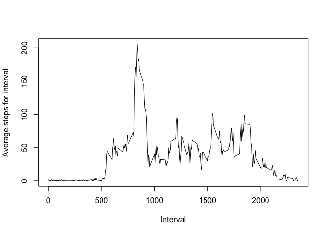
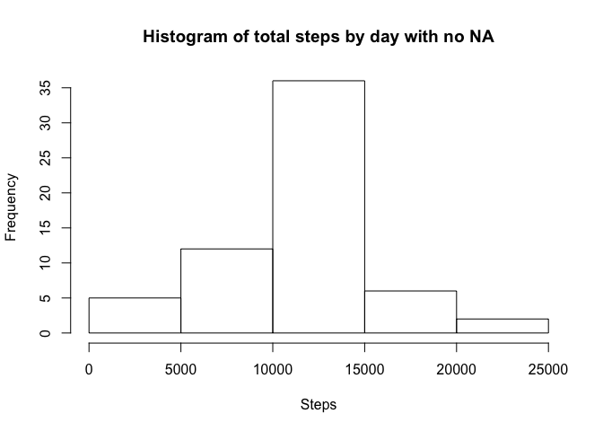

# Reproducible Research: Peer Assessment 1


## Loading and preprocessing the data

The first thing that we have to do is to read the data.


```r
activity = read.csv("activity.csv")
```

The data that we will obtain is a data frame with three variables and 17568 observations. For multiple days, there is no values (so NA are displayed)

## What is mean total number of steps taken per day?

First of all we will calculate the total number of steps per day.


```r
sumperday <- aggregate(activity$steps, by=list(activity$date), FUN=sum, na.rm = TRUE)
```

As we see, there are some days from where we don't have any data.
Now, we display an histogram of the total number of steps per day.

```r
hist(sumperday$x, main = 'Histogram of total steps by day', xlab = 'Steps')
```

 

Finally, we'll calculate the mean of the total number of steps per day

```r
mean(sumperday$x, na.rm = TRUE)
```

```
## [1] 9354.23
```

Also, we calculate the median


```r
median(sumperday$x, na.rm = TRUE)
```

```
## [1] 10395
```

## What is the average daily activity pattern?

First, we have to calculate the mean for each interval.


```r
meanperminute <- aggregate(activity$steps, by=list(activity$interval), FUN=mean, na.rm=TRUE)
```

Now, we plot this result


```r
plot(meanperminute$Group.1, meanperminute$x, type = 'l', xlab = 'Interval', ylab = 'Average steps for interval')
```

 

To determine the maximum of the intervals, we sort the data frame and print the first value


```r
head(meanperminute[rev(order(meanperminute$x)),], n= 1)
```

```
##     Group.1        x
## 104     835 206.1698
```

## Imputing missing values

First of all, we calculate the number of NAs in the steps column.


```r
sum(is.na(activity$steps))
```

```
## [1] 2304
```

Now, we will create a new dataset and we'll substitute the NAs with the average of that interval for all the years.


```r
activitynona = read.csv("activity.csv")
 for (i in 1:length(activitynona$steps)) {
     if(is.na(activitynona$steps[i])){
         activitynona$steps[i] <- round(subset(meanperminute$x, meanperminute$Group.1 == activitynona$interval[i]))
     }
 }
```

Again, we calculate the sum of steps per day, with the new dataset without NAs


```r
sumperdaynona <- aggregate(activitynona$steps, by=list(activitynona$date), FUN=sum, na.rm = TRUE)
```

After that, we print the histogram of the total steps by day with no NA. As we see in the result, the frequencies are bigger, as the NAs have been substituted with the most common result for that timezone.


```r
hist(sumperdaynona$x, main = 'Histogram of total steps by day with no NA', xlab = 'Steps')
```

 

Finally, we'll calculate the mean of the total number of steps per day with this new dataset


```r
mean(sumperdaynona$x, na.rm = TRUE)
```

```
## [1] 10765.64
```

Also, we calculate the median


```r
median(sumperdaynona$x, na.rm = TRUE)
```

```
## [1] 10762
```

With the new dataset the mean is a bigger number, as the NA days now have values for each interval.

## Are there differences in activity patterns between weekdays and weekends?

We determine which weekday is, and if it's sunday or saturday we mark it as weekend, and weekday if not.


```r
for (i in 1:length(activitynona$steps)) {
    if(weekdays(as.Date(activitynona$date[i])) == 'Sunday' || weekdays(as.Date(activitynona$date[i])) == 'Saturday'){
         activitynona$day[i] <- "weekend"
     }
     else{
         activitynona$day[i] <- "weekday"
     }
 }
```

We create subsets of data for weekdays and weekends.


```r
weekdays <- subset(activitynona, activitynona$day == 'weekday')
weekend <- subset(activitynona, activitynona$day == 'weekend')
```

We calculate the mean average for weekdays and for weekends


```r
meanperminuteweekday <- aggregate(weekdays$steps, by=list(weekdays$interval), FUN=mean)
meanperminuteweekend <- aggregate(weekend$steps, by=list(weekend$interval), FUN=mean)
```

Finally, we plot the two averages


```r
par(mfrow=c(2,1))
plot(meanperminuteweekday$Group.1, meanperminuteweekday$x, type = 'l', xlab = 'Interval', ylab = 'Average steps for interval during weekdays',  ylim=c(0, 200))
plot(meanperminuteweekend$Group.1, meanperminuteweekend$x, type = 'l', xlab = 'Interval', ylab = 'Average steps for interval during weekends',  ylim=c(0, 200))
```

 
